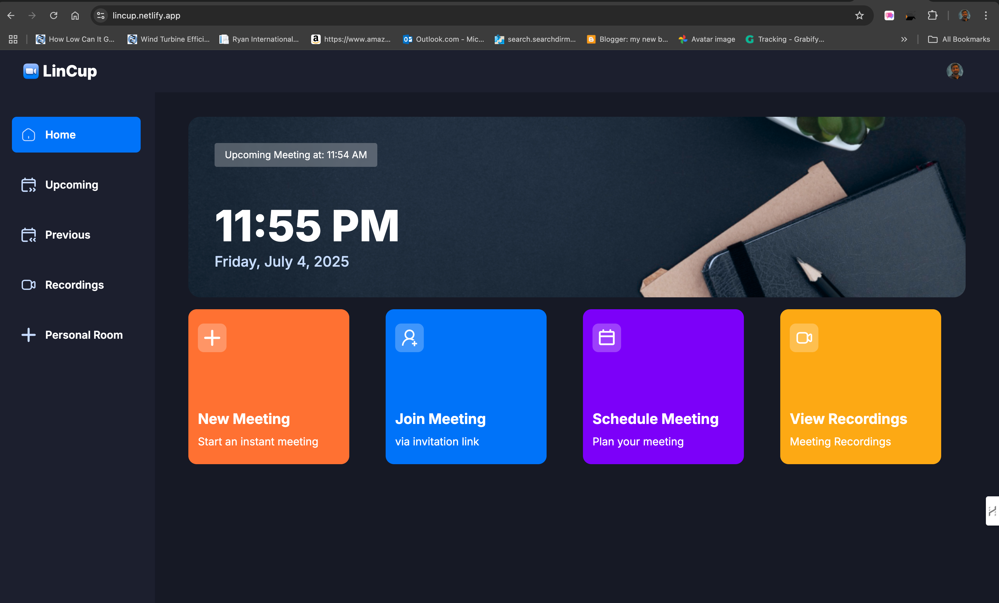

  

  <h1 align="center">LincUp - A Video Confrencing Web-Application</h3>
  

    
    
    
  

## 📋 <a name="table">Table of Contents</a>

1. 🤖 [Introduction](#introduction)
2. ⚙️ [Tech Stack](#tech-stack)
3. 🔋 [Features](#features)
4. 🕸️ [Assets & Code](#snippets)

## <a name="introduction">🤖 Introduction</a>

**LincUp** is a powerful video conferencing application built with the latest technologies like Next.js and TypeScript. It replicates core functionalities of Zoom, enabling users to authenticate securely, start and join meetings, record sessions, share screens, manage participants, and more.

## <a name="tech-stack">⚙️ Tech Stack</a>

- Next.js
- TypeScript
- Clerk
- getstream
- shadcn
- Tailwind CSS

## <a name="features">🔋 Features</a>

👉 **Authentication**: Secure sign-in/sign-up via Clerk (supports email/password, social logins).  
👉 **Start Meeting**: Instantly start a meeting after configuring camera/mic.  
👉 **Meeting Controls**: Manage screen share, mute/unmute, recording, emoji reactions, participant list, pin/block, and more.  
👉 **Schedule Meetings**: Add date/time and access via 'Upcoming Meetings' section.  
👉 **View Past Meetings**: Browse previously held meetings with metadata.  
👉 **Recordings Access**: Watch recordings of your past meetings.  
👉 **Personal Room**: Unique reusable meeting link for each user.  
👉 **Join by Link**: Paste a meeting link to instantly join.  
👉 **Real-time & Secure**: Built on real-time video APIs and secure protocols.  
👉 **Responsive UI**: Optimized design for all screen sizes.  

And much more including reusable component architecture, modular design, and scalable folder structure.

## <a name="snippets">🕸️ Snippets</a>

